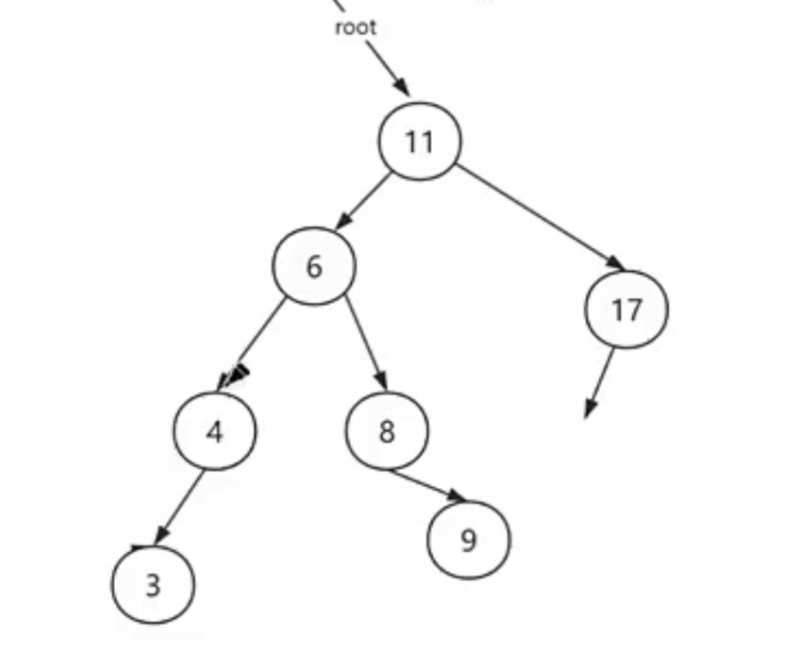
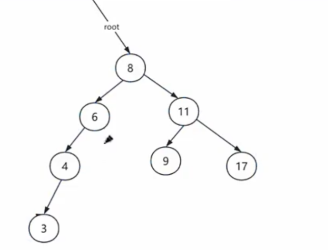

上面那个例子就是只能LL不能LR的，如果LR的话之后还是不平衡

# AVL树删除操作中旋转选择的原理

## 核心问题
在AVL树删除操作后出现不平衡时，当失衡节点的子树高度相等时，为什么要选择单旋转而不是双旋转？

## 关键原理

### 1. 高度变化的实际效果
- **单旋转**：能够有效降低较高一侧的高度，直接解决不平衡问题
- **双旋转**：在等高情况下可能无法充分降低高度，导致旋转后仍然不平衡

### 2. 具体情况分析

#### 右重情况（右子树比左子树高2）
```
条件：geth(t->right) - geth(t->left) > 1
设右子树根节点为 s
```

- **当 `geth(s->right) >= geth(s->left)` 时选择 RR旋转**
  - 原因：s的右子树至少与左子树等高，RR旋转能够有效提升s为新根，降低右侧整体高度
  - 如果选择RL旋转，可能无法充分平衡

#### 左重情况（左子树比右子树高2）
```
条件：geth(t->left) - geth(t->right) > 1  
设左子树根节点为 p
```

- **当 `geth(p->left) >= geth(p->right)` 时选择 LL旋转**
  - 原因：p的左子树至少与右子树等高，LL旋转能够有效提升p为新根，降低左侧整体高度
  - 如果选择LR旋转，可能无法充分平衡

### 3. 为什么双旋转在等高时效果不佳？

**以右重情况为例：**
- 如果s的左右子树等高，使用RL旋转需要：
  1. 先对s进行RR旋转（右旋）
  2. 再对整个子树进行LL旋转（左旋）
- 这种操作在等高情况下可能无法有效降低右侧的总高度

### 4. 实际验证的重要性
理论上的"平衡"不等于实际操作中的"有效平衡"。需要通过具体的树结构来验证旋转效果。

## 记忆口诀
**"等高选单旋，偏重选双旋"**

- 子树等高时：选择简单的单旋转（RR/LL）
- 子树有明显高度差时：选择双旋转（RL/LR）

## 注意事项
- 这个选择不是任意的，而是基于高度变化的数学原理
- 错误的旋转选择可能导致旋转后仍然不平衡
- 实际编程中应该严格按照高度比较的结果来选择旋转方式