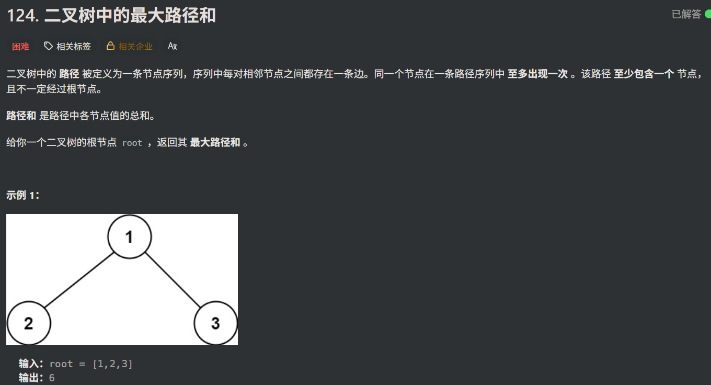

```
class Solution {
public:
	int ans = INT_MIN;
private:
	int helper(TreeNode* root) {
		if (!root)return 0;
		int left =max(0, helper(root->left));
		int right =max( 0,helper(root->right));
		ans = max(ans, root->val + left + right);
		return root->val +max( left,right);
	}
public:
	int maxPathSum(TreeNode* root) {
		helper(root);
		return ans;
	}
};
```

这道题至少困住了我一个小时，在递归条件那里问了两个AI都没有问到我想要的

所谓“递归贡献”指的就是递归向上传递的 **返回值** ，每次递归都要考虑递归的返回值到底是什么

就好比这个题，递归的返回值一定要是 **单条路径** 的返回值（*包括root节点，带上它的左子树或者右子树*） 而不是 **子树中最优的情况** ，因为子树中最优情况可能左右子树都包含了，那就不是单条路径了

谨记，一定要注意函数递归的返回值！！！