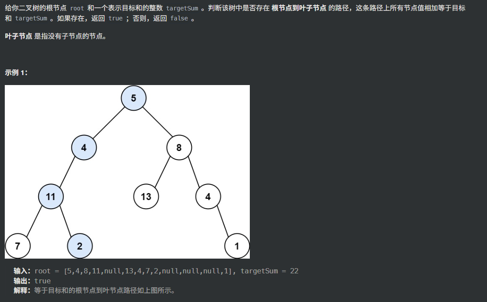

```
class Solution {
private:
	bool helper(TreeNode*root, int targetSum) {
		if (!root && targetSum != 0)return false;
		if (targetSum == 0)return true;
		bool is_left = helper(root->left, targetSum-root->val);
		return is_left ? is_left : helper(root->right, targetSum-root->val);
	}
public:
	bool hasPathSum(TreeNode* root, int targetSum) {
		if (!root)return false;
		bool ans = helper(root, targetSum);
		return ans;
	}
};
```

这是我一开始过不了的思路，后面看了题解才发现，路径是要走到叶子节点，而不是到了中间节点就结束了，而且targetSum最终不是要等于0，targetSum可以是任何值，包括0，所以判断条件也写错了

```
class Solution {
public:
	bool hasPathSum(TreeNode* root, int targetSum) {
		if (!root)return false;
		if (!root->left && !root->right)return targetSum == root->val;
		return hasPathSum(root->left, targetSum - root->val) || hasPathSum(root->right, targetSum - root->val);
	}
}; 
```

这个才是正确的题解。总而言之，一定要看清题目，注意递归终止条件。