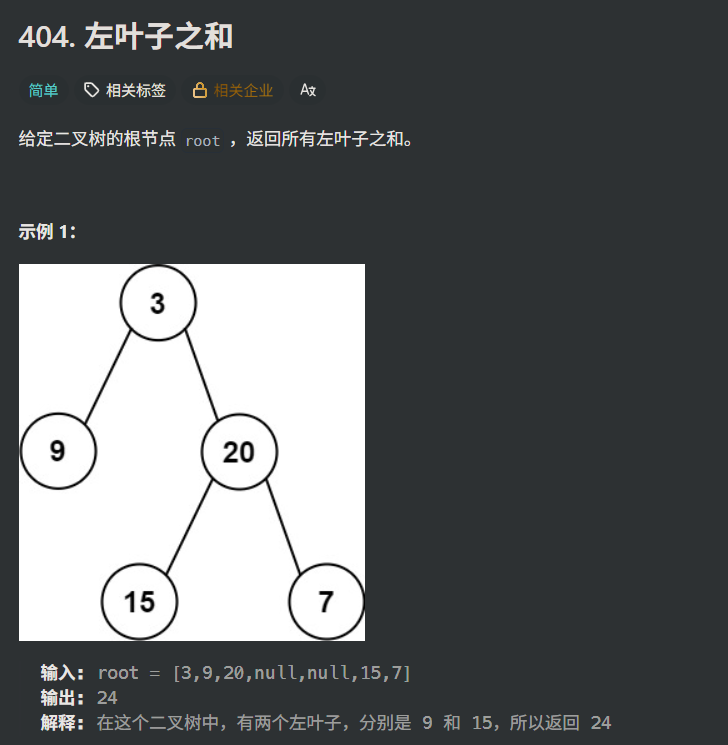

```
class Solution {
public:
	int sumOfLeftLeaves(TreeNode* root) {
		if (!root)return 0;
		int sum = 0;
		if (root->left && !root->left->left && !root->left->right)sum += root->left->val;
		return sum + sumOfLeftLeaves(root->left) + sumOfLeftLeaves(root->right);
	}
};
```

**这个是正确题解**

**从中汲取的思路：**

1. **每一次递归都很巧妙，每次递归的sum都是0，然后加上左右子树的递归结果，然后这层的结果又返回到上面去。其实这样的思路最简洁，也最好，因为我好像每次关于这种计算sum的问题都会在前面额外定义一个sum，然后只想着去通过void增加sum的值，这样就限制发挥了。**

之前的思路是，用while一直往左走，然后只递归右子树。这个解法有两个问题：

1. 最终的那个左子树，虽然不是root，但是他也不一定是叶子结点，可能这个左子树他还有右子树
2. 只遍历右子树更不行了，因为就按照1的说法，遍历到最终那个左子树的时候，不能再往这个树的右边遍历了，相当于是一直在遍历最上层的右子树
3. 后来在2的基础上改进了一下，每层左右子树都遍历一下，也不对，因为往左边遍历的话，每个左边的节点都会重复计算最左边那个树