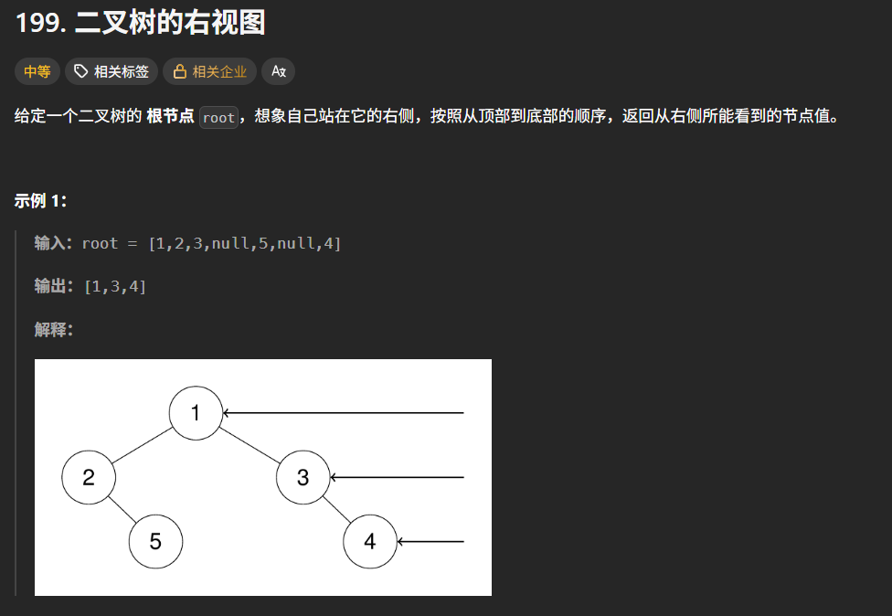

```c++
class Solution {
public:
    vector<int>ans;
    void helper(TreeNode* root, int h) {
        if (!root)return;
        if (ans.size() == h) {
            ans.push_back(root->val);
        }
        helper(root->right, h + 1);
        helper(root->left, h + 1);
    }
    vector<int> rightSideView(TreeNode* root) {
        helper(root, 0);
        return ans;
    }
};
```

这道题其实思路也有的，就是先遍历右子树后遍历左子树

**但是如何才能知道这个节点要不要存到答案数组里面呢？**那就用当前的高度和答案数组的size对比，如果之前这一层高度已经被右边的子树添加答案了的话，那么答案数组的size就会加一，这个时候就跟左子树的高度不相等了，而刚好这个时候就不用再管左子树了