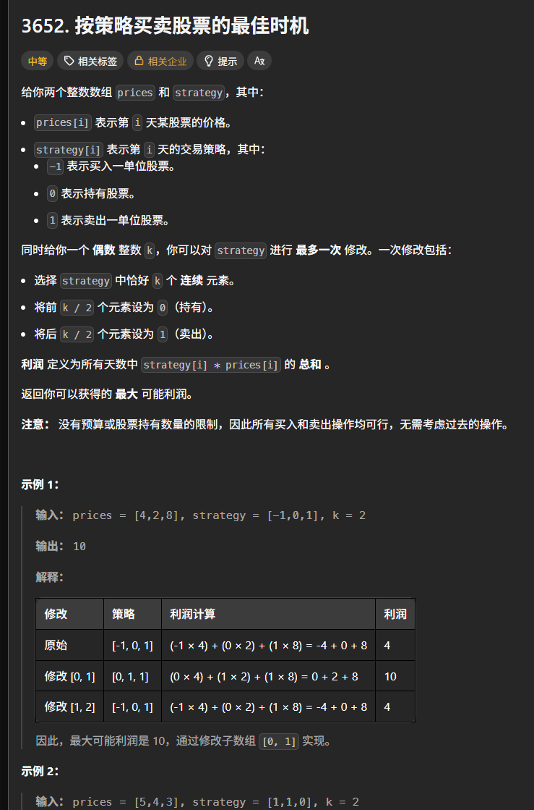

这题最开始用滑动窗口的时候其实很好理解 只是复杂了点，但是用到前缀和的时候一开始给我干烧了

不过现在来看突然就简单了

```c++
class Solution {
public:
    long long maxProfit(vector<int>& prices, vector<int>& strategy, int k) {
        long long sum = 0;
        long long ans = LLONG_MIN;
        int n = prices.size();
        vector<long long>preSum(n + 1);
        vector<long long>preSum0(n + 1);
        vector<long long>preSum1(n + 1);
        preSum[0] = 0;
        preSum0[0] = 0;
        preSum1[0] = 0;
        for (int i = 0; i < n; i++) {
            preSum[i + 1] = preSum[i] + prices[i] * strategy[i];
            preSum0[i + 1] = preSum0[i] + (0 - strategy[i]) * prices[i];
            preSum1[i + 1] = preSum1[i] + (1 - strategy[i]) * prices[i];
        }
        long long sum0 = preSum[n] - preSum[0];
        ans = max(ans, sum0);
        int mid = k / 2-1;
        int left = 0, right = k - 1;
        while (right < n) {
            long long sum = sum0+ (preSum0[mid + 1] - preSum0[left]) + (preSum1[right + 1] - preSum1[mid + 1]);
            ans = max(ans, sum);
            left++;
            right++;
            mid++;
        }
        return ans;
    }
};
```

题目思路方面，就是弄两个辅助前缀和，一个计算strategy全是0的时候，对于原始总值变化了多少（可能是负值），一个是计算strategy全为1的时候，同理。

但是滑动窗口里面更新sum的时候，就是在**原来的总值基础上**再利用辅助数组完成计算。

但是其中需要注意一些小细节：

1.前缀和也要用long long类型，这一步容易忽略

2.如果都是longlong类型的话，最小值或者最大值就不能用INT的了，得用LLONG_MIN(MAX)，要加头文件<climits>