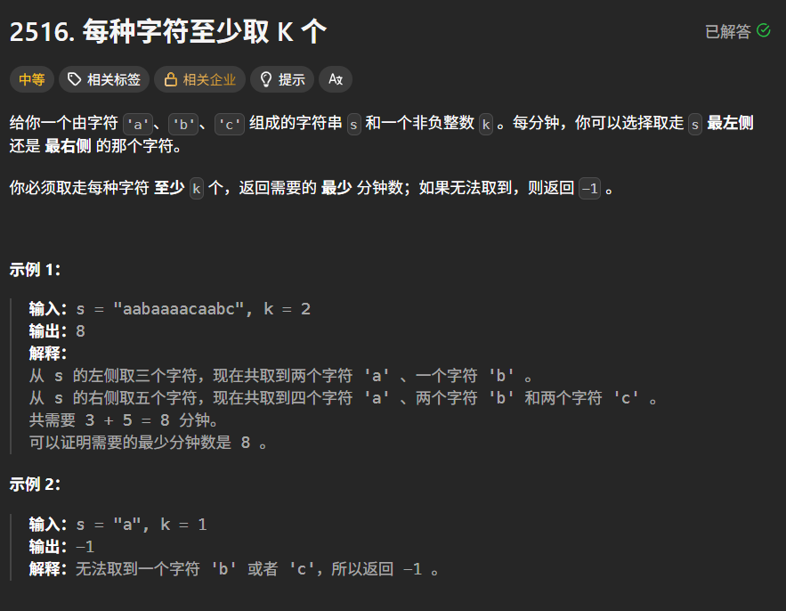

```c++
class Solution {
public:
    int takeCharacters(string s, int k) {
        if (k == 0)return 0;
        int n = s.length();
        unordered_map<char, int>count;
        int left = 0, right = 0;
        int ans = INT_MAX;
        for (int i = 0; i < s.length(); i++) {
            count[s[i]]++;
        }
        if (!(count['a'] >= k && count['b'] >= k && count['c'] >= k))return -1;
        while (right < n) {
            count[s[right]]--;
            while (!(count['a'] >= k && count['b'] >= k && count['c'] >= k)) {
                count[s[left]]++;
                left++;
            }
            ans = min(ans, n - (right - left + 1));
            right++;
        }
        return ans;
    }
};
```

还是转变思路转变思路转变思路！！！！

如果第一次的想法时间复杂度太高了的话，左边拿一下右边拿一下的，不仅容易出错（虽然写出来了），还容易超时

这个时候转变思路就是看中间剩下的元素，就不要看两遍了，如果只管中间的话就是标准的滑动窗口