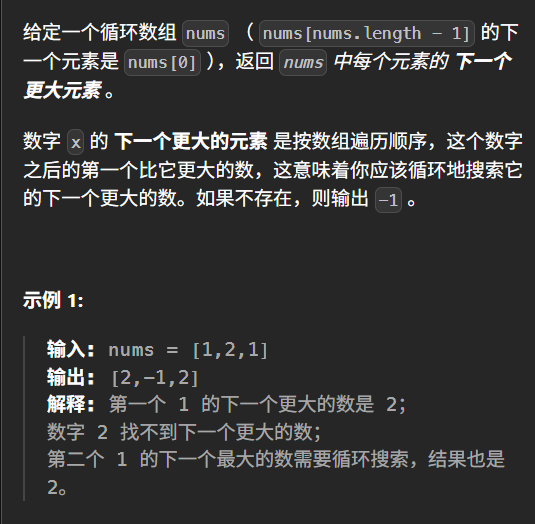

```
#include<iostream>
#include<vector>
#include<stack>
using namespace std;

class Solution {
public:
    vector<int> nextGreaterElements(vector<int>& nums) {
        int n = nums.size();
        vector<int> ans(n, -1);  // 初始化为-1
        stack<int> s;  // 存储元素值，不是索引
        
        // 遍历两遍数组（模拟循环数组）
        for (int i = 2 * n - 1; i >= 0; i--) {
            int idx = i % n;  // 实际索引
            
            // 弹出所有小于等于当前元素的值
            while (!s.empty() && s.top() <= nums[idx]) {
                s.pop();
            }
            
            // 只在第一遍时记录答案
            if (i < n) {
                ans[idx] = s.empty() ? -1 : s.top();
            }
            
            // 当前元素入栈
            s.push(nums[idx]);
        }
        
        return ans;
    }
};

int main() {
    int n; cin >> n;
    int x;
    vector<int> nums;
    for (int i = 0; i < n; i++) {
        cin >> x;
        nums.push_back(x);
    }
    
    Solution a;
    vector<int> ans = a.nextGreaterElements(nums);
    
    for (int x : ans) {
        cout << x << ' ';
    }
    cout << endl;
    
    return 0;
}
​```

## 算法思路

1. **从右向左遍历**：这样可以先处理右边的元素
2. **遍历两遍**：`i` 从 `2*n-1` 到 `0`，模拟循环数组
3. **栈维护递减序列**：栈顶是当前位置右边第一个更大的元素
4. **只在第一遍记录答案**：第二遍只是为了处理循环的情况

## 测试示例
​```
输入: [1,2,1]
输出: 2 -1 2

输入: [1,2,3,4,3]
输出: 2 3 4 -1 4
```

