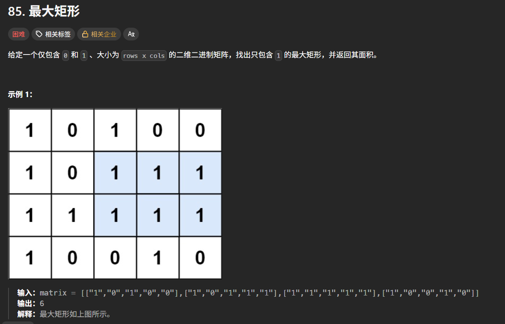

```
#include<iostream>
#include<vector>
#include<stack>
using namespace std;
class Solution {
public:
    int maximalRectangle(vector<vector<char>>& matrix) {
        int n = matrix.size();
        int m = matrix[0].size();
        int ans = 0;
        vector<int>height(m,0);
        stack<int>s;
        vector<int>left(m), right(m);
        for (int i = 0; i < n; i++) {
            s = stack<int>();
            for (int j = 0; j < m; j++) {
                if (matrix[i][j] == '0')height[j] = 0;
                else height[j] += 1;
            }
            for (int x = 0; x < m; x++) {
                while (!s.empty() && height[s.top()] >= height[x])s.pop();
                left[x] = s.empty() ? -1 : s.top();
                s.push(x);
            }
            s = stack<int>();
            for (int x = m - 1; x >= 0;x--) {
                while (!s.empty() && height[s.top()] >= height[x])s.pop();
                right[x] = s.empty() ? m : s.top();
                s.push(x);
            }
            for (int x = 0; x < m; x++) {
                ans = max(ans, (right[x] - left[x] - 1) * height[x]);
            }

        }
        return ans;
    }
};
int main() {
    int n, m; cin >> n >> m;
    vector<vector<char>>matrix(n, vector<char>(m));
    for (int i = 0; i < n; i++) {
        for (int j = 0; j < m; j++) {
            cin >> matrix[i][j];
        }
    }
    Solution a;
    int ans = a.maximalRectangle(matrix);
    cout << ans << endl;
}
```

