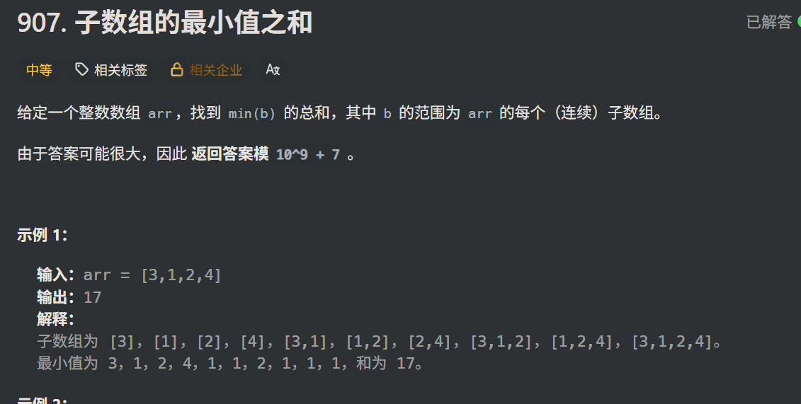

```
class Solution {
public:
    int sumSubarrayMins(vector<int>& arr) {
        int n = arr.size();
        stack<int>s;
        vector<int>left(n), right(n);
        for (int i = 0; i < n; i++) {
            while (!s.empty() && arr[s.top()] > arr[i])s.pop();
            left[i] = s.empty() ? i + 1 : i - s.top();
            s.push(i);
        }
        s = stack<int>();
        for (int i = n - 1; i >= 0; i--) {
            while (!s.empty() && arr[s.top()] >= arr[i])s.pop();
            right[i] = s.empty() ? n - i : s.top() - i;
            s.push(i);
        }
        long long sum = 0;
        for (int i = 0; i < n; i++) {
            sum = (sum +(long long) arr[i] * left[i] * right[i]) % (int)(1e9 + 7);
        }
        //左边可以选任意一个位置当起点，右边可以选任意一个位置当终点，所以是left[i]&right[i]
        return sum;
    }
};
```

这个题其实非常巧妙，他不是常规的例举每个区间，而是例举每个元素，看这个元素对最小值之和的贡献值。也是左右边界问题，用单调栈确定左右边界


此题思维上还可以用动态规划，但是时间复杂度太高了，为n*n,所以会超出时间限制

一开始想到动态规划是用二维数组，弄一个dp[i] [j]，但是空间复杂度太高了，连数组都建立不了，所以想让他至少运行不报错（不考虑能不能过这道题），**就得把他压缩成一个一维数组**  ***（在这里粗略了解了一下压缩数组的逻辑，具体的等复习到动态规划再详细思考***

