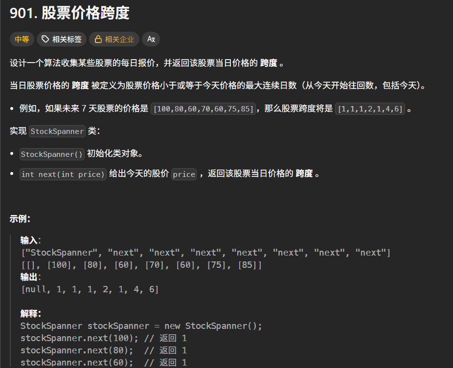

```c++
class StockSpanner {
public:
	stack<int>s;
	vector<int>nums;
	int n;
public:
	StockSpanner() {
		this->n = 0;
	}
	int next(int price) {
		nums.push_back(price);
		n++;
		int i = n - 1;
		while (!s.empty() && nums[i] >= nums[s.top()])s.pop();
		int ans = s.empty() ? i + 1 : i - s.top();
		s.push(i);
		return ans;
	}
};
```

**这种题，必须要存下标！！！** 如果只是计算出栈的次数，每次出栈的时候ans+1，然后返回ans的话，其实不对！！因为这个时候s存储的是具体的值，但是由于之前有值出了栈，所以计算出来的ans肯定是要比实际的小。所以这种题，无脑存储下标，而不是具体的值！！！