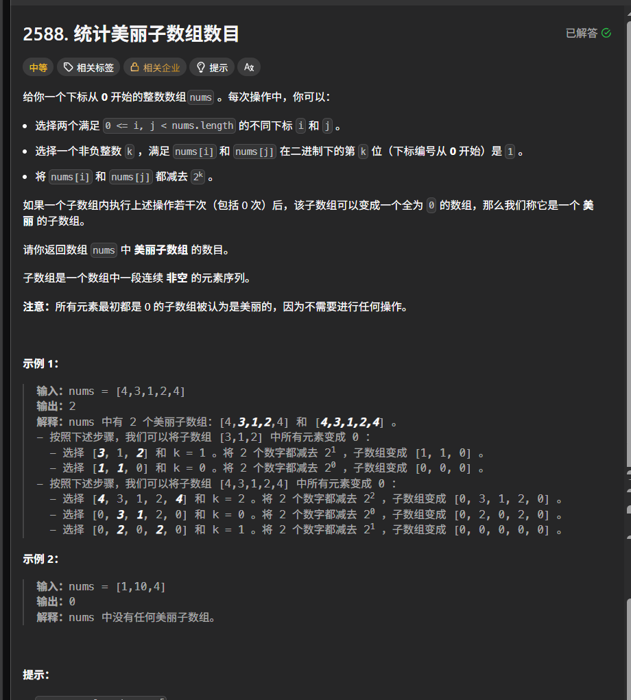

```c++
class Solution {
public:
    long long beautifulSubarrays(vector<int>& nums) {
        unordered_map<long long, int>count;
        count[0] = 1;
        long long ans = 0;
        long long res = 0;
        for (auto& x : nums) {
            res ^= x;
            ans += count[res];
            count[res]++;
        }
        return ans;
    }
};
```

这道题学会之前需要了解一些基本常识

1. a^0=a  a^a=0 a^b=c---->b=c^a
2. 1^1=0  1^1^1=1  1^1^1^1=0
3. 题目翻译成人话就是，子数组中的数字 每个位数的1的数量得是偶数，这样的话就能两两互消（也就是说子数组每个数依次异或的结果得是0）

这道题需要注意的事项

s[0]=0，cnt[0]=1.如何设定cnt的初始值？就是看什么数参与运算不会改变原值  而且恰好s[0]^nums[0]=nums[0]。