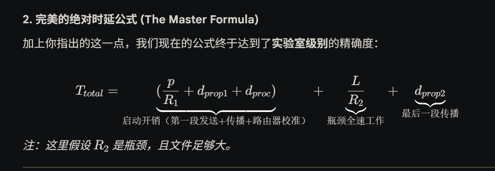

第二段比第一段慢，就代表第二段永远都是满负荷的，不可能没有人不在排队，所以当最后一个字节发到路由器上的时候，那个队伍其实还在，并且一直都有人排队，**所以发送时延还是总的队伍除以通过队伍的速率，总的时延靠的还是最慢的那个时延！**然后t2跟t1是重叠的，当最后一个字节还在第一个节点那里排队上车的时候，其实第二个节点已经在发送了，所以t1完全不用加！看的还是t2！如果实在要算那个最细微的时间的话，就是第一个节点到第二个节点的传播时间再加上路由器校准的时间

如果非要钻牛角尖的话 就是以下公式：

